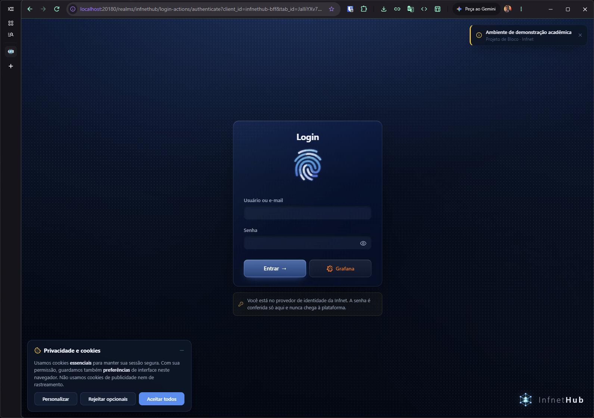
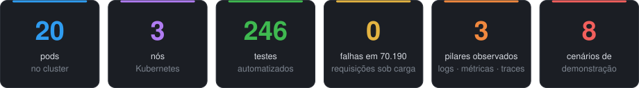
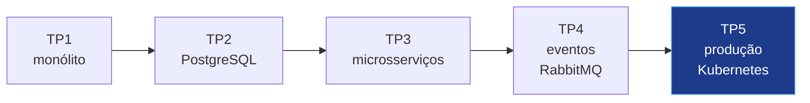
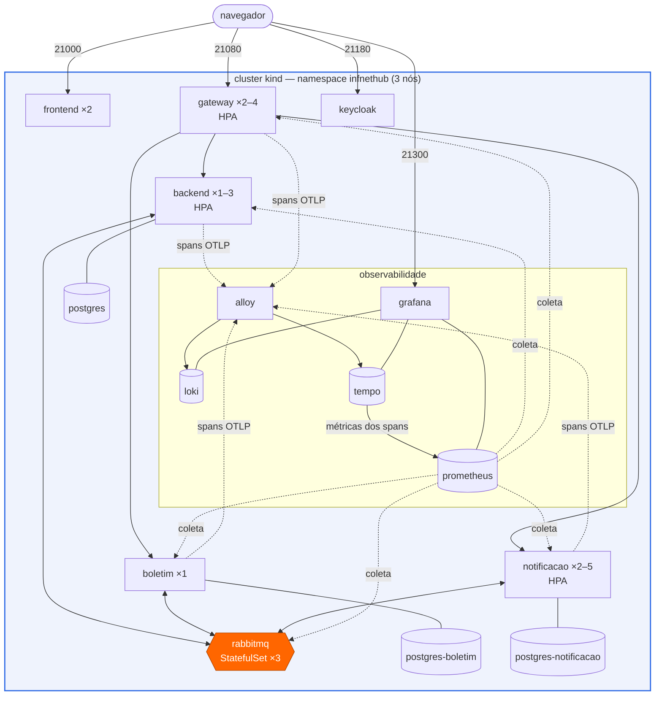
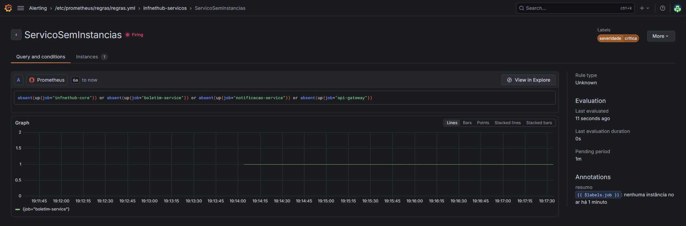
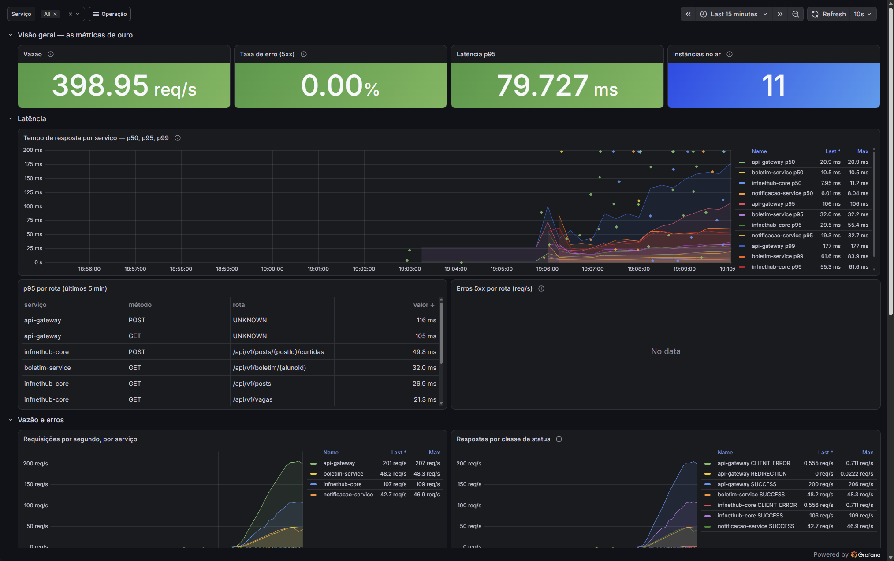
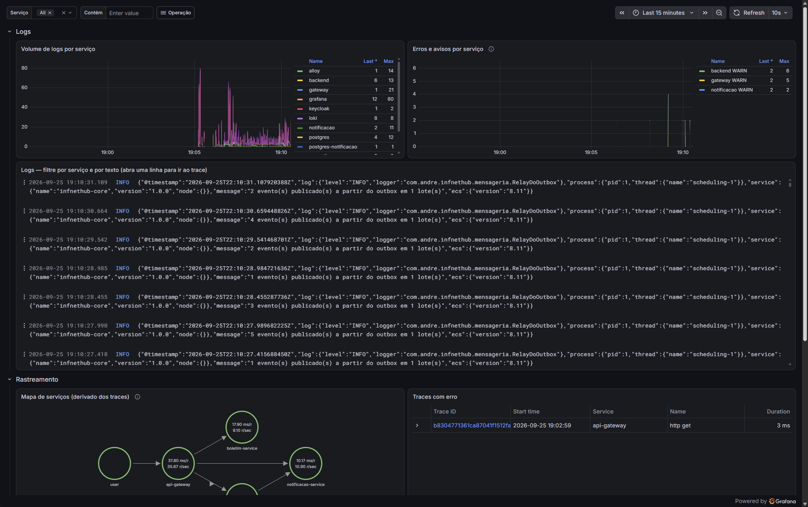
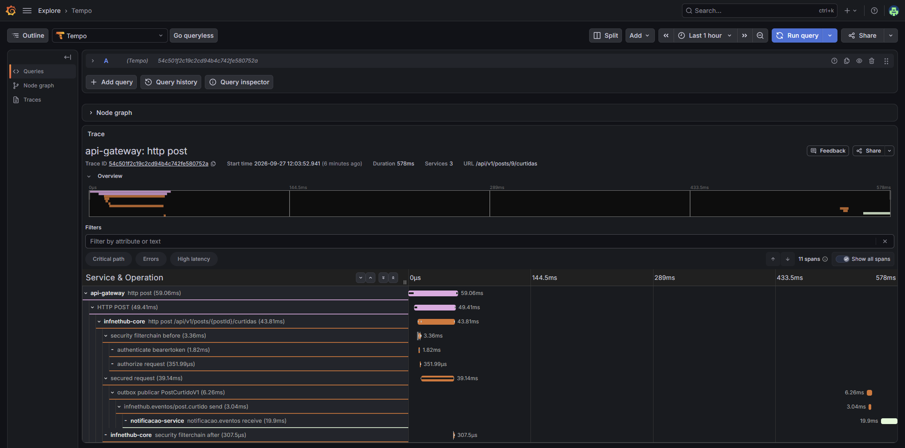
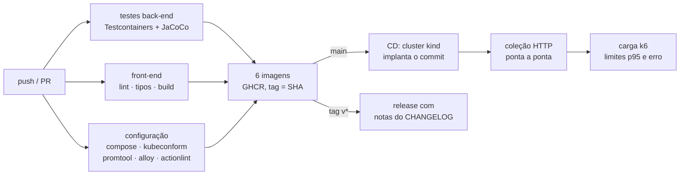
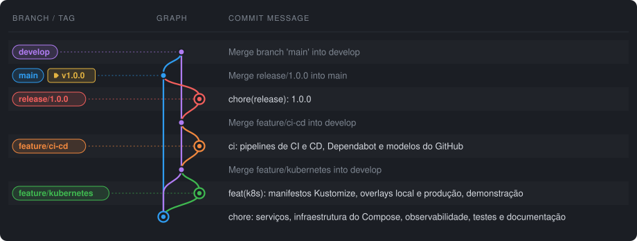

<div align="center">


**Conteinerização, Kubernetes, observabilidade e CI/CD para os microsserviços do Infnet Hub**<br/>
quinta e última entrega do Projeto de Bloco: Engenharia de Softwares Escaláveis (DR5)

[](doc/RELATORIO_TP5-PB.md)

[](https://www.infnet.edu.br)
[](https://www.infnet.edu.br)
[](https://www.infnet.edu.br)

[](https://github.com/andrebecker84/TP5-PB_producao/actions/workflows/ci.yml)
[](https://github.com/andrebecker84/TP5-PB_producao/actions/workflows/cd.yml)
[](#testes)
[](#kubernetes)
[](CHANGELOG.md)
[](LICENSE)



<br/><br/>



</div>

## Índice

| | Implantação e operação | | Qualidade e referência |
|:---:|---|:---:|---|
| 01 | [Sobre o Projeto](#sobre-o-projeto) | 08 | [Testes](#testes) |
| 02 | [Arquitetura de implantação](#arquitetura-de-implantação) | 09 | [Demonstração](#demonstração) |
| 03 | [Como Executar](#como-executar) | 10 | [Gestão de configuração e versionamento](#gestão-de-configuração-e-versionamento) |
| 04 | [Docker](#docker) | 11 | [Stack](#stack) |
| 05 | [Kubernetes](#kubernetes) | 12 | [Estrutura do Projeto](#estrutura-do-projeto) |
| 06 | [Observabilidade](#observabilidade) | 13 | [Relatório Técnico](#relatório-técnico) |
| 07 | [CI/CD com GitHub Actions](#cicd-com-github-actions) | 14 | [Licença](#licença) |

---

## Sobre o Projeto

O **Infnet Hub** é uma plataforma educacional — feed, vagas, boletim por competência e
notificações ao vivo — construída ao longo de cinco entregas:



Esta entrega **leva o sistema para a operação**: o mesmo código dos serviços roda num cluster
Kubernetes com autoescalonamento, autocura e atualização sem interrupção; cada requisição
pode ser seguida de ponta a ponta — inclusive através do RabbitMQ — em traces, logs e
métricas ligados entre si; e um pipeline constrói, testa, publica e implanta cada commit.

| Novidade | O que é |
|---|---|
| ☸️ **Kubernetes** | Kustomize com overlays local e produção; HPA, PDB, sondas, NetworkPolicy, contêineres sem root |
| 🔭 **Rastreamento distribuído** | OpenTelemetry → Tempo; o `traceparent` atravessa gateway, serviços, **caixa de saída** e RabbitMQ |
| 📜 **Agregação de logs** | JSON (ECS) → Grafana Alloy → Loki, com o `traceId` em cada linha |
| 🚨 **Alertas** | Sete regras no Prometheus: serviço fora ou sem instâncias, erro, latência, mensagem morta, outbox parada, nó do broker |
| 🔁 **CI/CD** | GitHub Actions: testes, validação da configuração, imagens no GHCR, implantação num cluster e testes contra ele |
| 🧪 **Testes** | 250 automatizados + coleção HTTP de ponta a ponta + teste de carga k6 com limites |

> [!IMPORTANT]
> O que a entrega prova não é que o sistema *sobe* num cluster, mas que ele **aguenta operar**:
> sob 60 usuários simultâneos o cluster criou réplicas sozinho e respondeu 70.190 requisições
> sem nenhuma falha; durante uma atualização do gateway, nenhuma requisição se perdeu.

<p align="right"><a href="#índice">⬆ voltar ao índice</a></p>

## Arquitetura de implantação



O mesmo desenho roda também no **Docker Compose** (desenvolvimento), com TLS em todos os trechos
e o Eureka como registro; no cluster, o registro é o próprio Kubernetes (Service + DNS +
readiness), sem alterar as rotas do gateway.

<p align="right"><a href="#índice">⬆ voltar ao índice</a></p>

## Como Executar

**Pré-requisitos:** Docker Desktop, `kubectl` e [`kind`](https://kind.sigs.k8s.io/) (`scoop install kind`
no Windows, `brew install kind` no macOS).

### Produção simulada — Kubernetes

```bash
./k8s/implantar.sh
```

Cria um cluster kind de três nós, instala o metrics-server, constrói as imagens, carrega-as nos
nós e aplica os manifestos, esperando cada componente ficar pronto (≈ 5 min na primeira vez).

| Para ver | Onde |
|---|---|
| 🖥️ **Aplicação** | [localhost:21000](http://localhost:21000) |
| 📊 **Grafana** — operação, serviços, logs e rastreamento | [localhost:21300](http://localhost:21300) (conta `suporte.ti`) |
| 🐇 **Painel do RabbitMQ** | [localhost:21673](http://localhost:21673) (`infnethub` / `infnethub`) |
| 🔑 **Keycloak** — login e contas | [localhost:21180](http://localhost:21180) |

```bash
kubectl -n infnethub get pods,hpa -o wide     # o cluster
kind delete cluster --name infnethub          # remover
```

### Desenvolvimento — Docker Compose

```bash
docker compose up -d
```

Mesmas portas, dezenove contêineres, TLS entre todos. Compose e cluster **não sobem juntos**.

> [!TIP]
> No Windows, rode os `.sh` pelo Bash do Git:
> `& "$env:USERPROFILE\scoop\apps\git\current\bin\bash.exe" ./k8s/implantar.sh`

> [!NOTE]
> **Contas de demonstração**, todas com a senha `infnet`: `lucas.mendonca` (aluno),
> `carlos.oliveira` (professor), `atendimento` (secretaria) e `suporte.ti` (único papel que entra
> no Grafana).

<p align="right"><a href="#índice">⬆ voltar ao índice</a></p>

## Docker

Seis imagens, cada uma em **três estágios**:

| Estágio | Faz | Por quê |
|---|---|---|
| `compilacao` | Maven + JDK 25; poms antes do código | a camada de dependências é reaproveitada entre commits |
| `camadas` | `java -Djarmode=tools extract --layers` | o JAR vira quatro camadas; num deploy típico só a da aplicação (KB) muda |
| `final` | JRE 25 Alpine, **usuário 10001** (grupo 0), rótulos OCI | nada roda como root; a imagem diz de qual commit veio |

O front-end (Next.js 16, saída *standalone*) roda como o usuário `node`. As mesmas imagens servem
ao Compose e ao Kubernetes — o que muda entre ambientes é configuração, nunca o artefato.

<p align="right"><a href="#índice">⬆ voltar ao índice</a></p>

## Kubernetes

Manifestos em [`k8s/`](k8s/), montados com **Kustomize**:

```
k8s/base/                 o sistema — igual em todo ambiente
k8s/overlays/local/       imagens locais, segredos de desenvolvimento, NodePort (kind)
k8s/overlays/producao/    imagens do GHCR, segredos fora do repositório, Ingress com TLS, JVM de produção
```

| Recurso | Uso |
|---|---|
| **Deployment** | serviços sem estado; `RollingUpdate` com `maxUnavailable: 0`; espalhados entre nós |
| **StatefulSet** | PostgreSQL ×3, RabbitMQ ×3 (cluster formado pelo ordinal do pod), Loki, Tempo |
| **Sessão compartilhada** | Redis com as sessões de login do gateway: qualquer réplica atende qualquer navegador, e reiniciar uma não desloga ninguém |
| **HorizontalPodAutoscaler** | gateway 2–4, core 1–3, notificação 2–5, por CPU (meta 70%) |
| **PodDisruptionBudget** | nunca o último pod do gateway, do front-end, da notificação; um nó do broker por vez |
| **Sondas** | *startup* (subida longa), *readiness* (inclui o banco), *liveness* (só o processo), com prazo de resposta de 3 e 5 s |
| **NetworkPolicy** | entrada negada por padrão; cada banco aceita só o seu serviço — verificado: o front-end não alcança o PostgreSQL |
| **securityContext** | sem root, sem escalada, raiz só leitura, sem *capabilities*, seccomp |
| **ConfigMap / Secret** | configuração no ambiente (12-factor); segredos gerados pelo overlay |

O código ganhou o perfil **`k8s`** (`application-k8s.*`): descoberta pelo cluster no lugar do
Eureka, saída graciosa, *readiness* com o banco e logs em JSON.

<p align="right"><a href="#índice">⬆ voltar ao índice</a></p>

## Observabilidade

Os três pilares, e as ligações entre eles:

| Pilar | Caminho | No Grafana |
|---|---|---|
| **Métricas** | Actuator/Micrometer → Prometheus (descoberta de pods) | painéis *operação* e *serviços*: p50/p95/p99, erro, vazão, CPU, memória, filas |
| **Logs** | JSON (ECS) na saída padrão → **Alloy** → **Loki** | painel *logs e rastreamento*; filtro por serviço, nível, texto e `traceId` |
| **Traces** | OpenTelemetry (OTLP) → **Alloy** → **Tempo** | mapa de serviços, traces com erro, trace completo de cada requisição |

Um cadastro feito no cluster, como o Tempo o mostra (dezenove spans, quatro serviços):

```
     0 ms  api-gateway          http post
    14 ms  infnethub-core       http post /api/v1/usuarios
   611 ms  infnethub-core       outbox publicar UsuarioCadastradoV1   ← o relay, meio segundo depois
   623 ms  infnethub-core       infnethub.eventos/usuario.cadastrado send
   670 ms  boletim-service      boletim.usuarios receive
   686 ms  notificacao-service  notificacao.eventos receive
   969 ms  notificacao-service  notificacao.aovivo.… receive          ← fanout: réplica 1
   980 ms  notificacao-service  notificacao.aovivo.… receive          ← fanout: réplica 2
```

> [!TIP]
> O trace só atravessa a caixa de saída porque o `traceparent` é **gravado junto com o evento**
> e retomado pelo relay. Sem isso, a publicação apareceria como um trace novo, sem pai. E o gateway
> devolve o identificador em toda resposta, no cabeçalho **`X-Trace-Id`**.

**Alertas** ([`infra/prometheus/regras.yml`](infra/prometheus/regras.yml)): `ServicoForaDoAr`, `ServicoSemInstancias`,
`TaxaDeErroAlta`, `LatenciaAlta`, `MensagensMortas`, `CaixaDeSaidaParada`, `NoDoBrokerFora`.
Com o boletim reduzido a zero réplicas (cenário 7 da demonstração), `ServicoSemInstancias` dispara
em cerca de um minuto:



**Painel *serviços*** durante o teste de carga `escala`: cerca de 400 req/s, nenhum erro 5xx e
onze instâncias no ar, depois que o HPA escalou o gateway, o core e a notificação.



**Painel *logs e rastreamento***: volume de logs e avisos por serviço vindos do Loki, busca nos logs,
mapa de serviços derivado dos traces e traces com erro.



**Um trace no Tempo**: uma curtida passa pelo gateway, pelo core, pela caixa de saída e pelo RabbitMQ
até o serviço de notificação, e aparece como um trace só.



<p align="right"><a href="#índice">⬆ voltar ao índice</a></p>

## CI/CD com GitHub Actions



| Workflow | Quando | O que garante |
|---|---|---|
| [`ci.yml`](.github/workflows/ci.yml) | push em `main`, `develop`, `release/*`, `hotfix/*`, tags e todo PR | código testado, configuração válida, imagens construídas (publicadas só na `main` e nas tags) |
| [`cd.yml`](.github/workflows/cd.yml) | CI verde na `main` | as imagens **daquele commit** sobem num cluster, respondem a 107 requisições com asserções e aguentam carga |

Só ações oficiais (`actions/*`, `docker/*`); `GITHUB_TOKEN` com a menor permissão de cada job;
imagens identificadas pelo SHA do commit, imutáveis.

<p align="right"><a href="#índice">⬆ voltar ao índice</a></p>

## Testes

| Nível | O que prova | Onde | Volume |
|---|---|---|---|
| **Unidade** | regras de domínio, contratos, filtros, rastreamento | `*/src/test` | 250 testes JUnit, somando os três níveis |
| **Fatia** | JPA, web, segurança | `@DataJpaTest`, `@WebMvcTest` | incluídos nos 250 |
| **Integração** | PostgreSQL e **RabbitMQ reais** (Testcontainers): outbox, confirmação, DLQ, saga, trace pelo broker | `*IntegracaoTest` | incluídos nos 250 |
| **Ponta a ponta** | o sistema montado, no Compose ou no cluster | [`testes/e2e.sh`](testes/e2e.sh) | 107 requisições |
| **Carga** | latência e erro sob concorrência | [`testes/carga/`](testes/carga/) (k6) | 2 perfis |
| **Pós-implantação** | cada commit da `main`, num cluster novo | [`cd.yml`](.github/workflows/cd.yml) | a cada entrega |

```bash
./mvnw verify                      # testes + cobertura (target/site/jacoco)
./testes/e2e.sh                    # coleção HTTP contra o ambiente no ar
./testes/carga/rodar.sh escala     # k6: até 60 usuários por 7 minutos
```

Medido no cluster local, perfil `escala`:

| Versão | Requisições | Falhas | p50 | p95 | p99 | Réplicas no pico |
|---|---:|---:|---:|---:|---:|---|
| 1.0.0 | 70.190 | **0** | 16 ms | 47 ms | 90 ms | gateway 4 · core 3 · notificação 5 (o máximo de cada HPA) |
| 1.0.1 | 64.705 | **0** | 20 ms | 135 ms | 495 ms | gateway 4 · core 3 · notificação 3, sem nenhum reinício |

Na 1.0.1 cada resposta do feed carrega as curtidas e os comentários de todos os posts, e por isso
pesa mais: o p95 subiu. Na tela, o saldo é o contrário, porque abrir o feed passou de 17
requisições para uma.

<p align="right"><a href="#índice">⬆ voltar ao índice</a></p>

## Demonstração

```bash
./demo/producao.sh          # lista os cenários
./demo/producao.sh 5        # roda um
```

| # | Cenário | O que prova |
|:---:|---|---|
| 1 | **A implantação** | 21 pods em 3 nós, HPA e PDB configurados |
| 2 | **Autocura** | um pod removido é reposto; nenhuma requisição falha |
| 3 | **Autoescalonamento** | sob carga k6, o HPA cria réplicas e depois as remove |
| 4 | **Atualização sem interrupção** | *rolling update* com tráfego, e `rollout undo` |
| 5 | **Rastreamento** | uma requisição, quatro serviços, um trace — pelo `X-Trace-Id` |
| 6 | **Logs agregados** | os logs daquela requisição, de todos os pods |
| 7 | **Alerta** | serviço fora do ar detectado pelo Prometheus |
| 8 | **Nó do broker cai** | o cluster do RabbitMQ segue; o StatefulSet repõe o nó |

Os dez cenários de eventos do TP4 continuam em [`demo/cenarios.sh`](demo/cenarios.sh) (Compose).

<p align="right"><a href="#índice">⬆ voltar ao índice</a></p>

## Gestão de configuração e versionamento

- **Git Flow**: `main` guarda só o que foi lançado (cada versão com sua tag); `develop` é a
  integração; `feature/*` e `fix/*` saem de `develop` e voltam por pull request; `release/*`
  prepara a versão e entra na `main` por pull request, seguida da tag e do merge de volta em
  `develop`; `hotfix/*` sai da `main` para correções urgentes.

  
- **GitHub**: `main` e `develop` protegidas, mudanças só por pull request com o
  [modelo](.github/pull_request_template.md) e o CI verde como condição para o merge; o
  [CODEOWNERS](.github/CODEOWNERS) marca o responsável como revisor.
- **Commits convencionais** (`feat:`, `fix:`, `ci:`, `docs:`…) e **versões semânticas** em tags
  `v*` — a tag dispara a release com as notas do [`CHANGELOG.md`](CHANGELOG.md).
- **Dependabot** semanal para Maven, npm, imagens Docker e ações, com os PRs mirando a `develop`.
- **Configuração fora do código**: `.env` no Compose, ConfigMap/Secret no cluster; o overlay de
  produção lê os segredos de um arquivo não versionado.

<p align="right"><a href="#índice">⬆ voltar ao índice</a></p>

## Stack

| Camada | Tecnologias |
|---|---|
| **Back-end** |    |
| **Mensageria e dados** |    |
| **Front-end** |    |
| **Implantação** |     |
| **Observabilidade** |       |
| **CI/CD e testes** |       |

<p align="right"><a href="#índice">⬆ voltar ao índice</a></p>

## Estrutura do Projeto

<details>
<summary><b>Árvore de pastas</b></summary>

```
TP5-PB_producao/
├── contratos/  infnethub-core/  boletim-service/  notificacao-service/
├── api-gateway/  eureka-server/  frontend/          os serviços (Dockerfile em cada um)
│   └── …/observabilidade/                           rastreamento pela caixa de saída, filtro de ruído, X-Trace-Id
├── k8s/
│   ├── kind.yaml · kind-ci.yaml                     o cluster local (3 nós) e o do CI
│   ├── base/                                        Deployments, StatefulSets, HPA, PDB, NetworkPolicy
│   │   └── observabilidade/                         Prometheus, Grafana, Loki, Tempo, Alloy
│   ├── overlays/local · overlays/producao
│   ├── complementos/metrics-server
│   └── implantar.sh
├── infra/                                            configuração compartilhada (Keycloak, RabbitMQ,
│   ├── alloy/ loki/ tempo/                          Prometheus, Grafana, certificados) + coletores
│   ├── prometheus/regras.yml                        alertas
│   └── grafana/paineis/                             três painéis versionados em JSON
├── .github/workflows/ci.yml · cd.yml                o pipeline
├── testes/e2e.sh · testes/carga/                    ponta a ponta e carga (k6)
├── demo/producao.sh · demo/cenarios.sh              demonstração do TP5 e do TP4
├── http/                                             coleção de 107 requisições
├── doc/RELATORIO_TP5-PB.md · doc/asyncapi.yaml
├── CHANGELOG.md
└── docker-compose.yml
```

</details>

<p align="right"><a href="#índice">⬆ voltar ao índice</a></p>

## Relatório Técnico

A documentação completa — decisões, medições, armadilhas, roteiro da apresentação e a cobertura
de cada rúbrica — está em [`doc/RELATORIO_TP5-PB.md`](doc/RELATORIO_TP5-PB.md). Os padrões de
mensagem e a arquitetura de eventos estão no
[relatório do TP4](https://github.com/andrebecker84/TP4-PB_eventos/blob/main/doc/RELATORIO_TP4-PB.md),
e a especificação dos canais em [`doc/asyncapi.yaml`](doc/asyncapi.yaml).

<p align="right"><a href="#índice">⬆ voltar ao índice</a></p>

## Licença

**Licença de Código Visível — Somente Leitura.** Todos os direitos reservados. Este repositório é
*source-available*, não código aberto: é público para ser **lido, estudado e avaliado**.
Copiar, clonar, executar, modificar ou redistribuir requer autorização escrita — peça por uma
[issue](https://github.com/andrebecker84/TP5-PB_producao/issues). O corpo docente pode executar o
projeto no necessário à avaliação. Texto integral, integridade acadêmica e aviso de proteção de
dados (LGPD) em [LICENSE](LICENSE).

O repositório **não contém dados pessoais reais**; as contas e registros são fictícios. Os logs
agregados levam identificadores (`traceId`, id do usuário), nunca senha ou token, e o Loki os
descarta em sete dias.

**Créditos:** ilustrações 3D da página 404 — [Vecteezy](https://www.vecteezy.com)
([licença](https://www.vecteezy.com/licensing-agreement)).

<div align="center">

[](https://linkedin.com/in/becker84)
[](https://github.com/andrebecker84)


</div>
