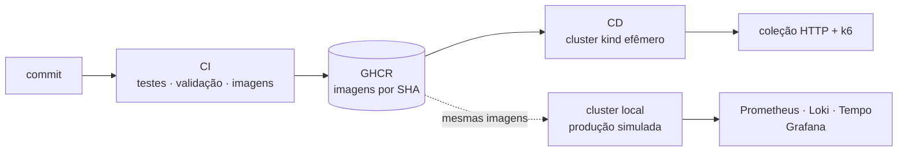

# Relatório Técnico — Infnet Hub · TP5: Implantação e Manutenção em Produção

**Disciplina:** Projeto de Bloco: Engenharia de Softwares Escaláveis (DR5) — Instituto Infnet<br/>
**Aluno:** André Luis Becker · **Trimestre:** 26E2 · **Versão:** 1.0.1<br/>
**Repositório:** [andrebecker84/TP5-PB_producao](https://github.com/andrebecker84/TP5-PB_producao)

> Objetivo da etapa: preparar o sistema desenvolvido para operação através de conteinerização,
> monitoramento e testes. Todos os números deste relatório foram medidos no ambiente descrito
> na seção 3; nenhum é estimativa.

## Sumário

**Parte I — Contexto**
1. [Ponto de partida e o que faltava para operar](#1-ponto-de-partida-e-o-que-faltava-para-operar)
2. [Visão geral da solução](#2-visão-geral-da-solução)
3. [Ambientes](#3-ambientes)

**Parte II — Docker e Kubernetes**
4. [Imagens](#4-imagens)
5. [Topologia no cluster](#5-topologia-no-cluster)
6. [O código adaptado ao orquestrador](#6-o-código-adaptado-ao-orquestrador)
7. [Escalabilidade, disponibilidade e segurança](#7-escalabilidade-disponibilidade-e-segurança)

**Parte III — Monitoramento**
8. [Logs estruturados e agregação](#8-logs-estruturados-e-agregação)
9. [Rastreamento distribuído — inclusive pela caixa de saída](#9-rastreamento-distribuído--inclusive-pela-caixa-de-saída)
10. [Métricas, painéis e alertas](#10-métricas-painéis-e-alertas)

**Parte IV — Gestão de configuração, versionamento e CI/CD**
11. [Git, GitHub e configuração](#11-git-github-e-configuração)
12. [Integração contínua](#12-integração-contínua)
13. [Entrega contínua](#13-entrega-contínua)

**Parte V — Testes**
14. [Estratégia e números](#14-estratégia-e-números)
15. [Carga e atualização sob tráfego](#15-carga-e-atualização-sob-tráfego)

**Parte VI — Operação e demonstração**
16. [Roteiro da apresentação](#16-roteiro-da-apresentação)
17. [Do alerta à causa: como diagnosticar](#17-do-alerta-à-causa-como-diagnosticar)
18. [Armadilhas encontradas](#18-armadilhas-encontradas)
19. [Limitações e próximos passos](#19-limitações-e-próximos-passos)
20. [Cobertura das rúbricas](#20-cobertura-das-rúbricas)
21. [Referências](#21-referências)

---

# Parte I — Contexto

## 1. Ponto de partida e o que faltava para operar

O TP4 entregou seis serviços orientados a eventos (RabbitMQ em cluster, caixa de saída, saga de
expurgo, Keycloak, TLS entre contêineres) rodando num `docker compose up`. Funcionava — mas só
numa máquina, do jeito que foi ligado, e com três pontos cegos para quem opera:

| Lacuna no TP4 | Consequência | Resposta no TP5 |
|---|---|---|
| Um Compose numa máquina | sem réplica automática, sem autocura, atualização = derrubar e subir | **Kubernetes**: Deployments, StatefulSets, HPA, PDB, sondas |
| Logs só no `docker logs` de cada contêiner | investigar um erro exige abrir seis terminais | **Loki**: todos os logs, pesquisáveis por serviço, nível e `traceId` |
| Nenhum rastreamento | impossível seguir uma requisição que vira evento | **Tempo** + OpenTelemetry, atravessando a caixa de saída e o RabbitMQ |
| Build e testes manuais | uma imagem publicada não prova nada | **GitHub Actions**: CI + CD com implantação num cluster e testes contra ele |

## 2. Visão geral da solução



O mesmo artefato — a imagem de cada serviço — passa por testes, por um cluster descartável no
pipeline e pelo cluster da demonstração. O que muda entre ambientes é configuração
(ConfigMap/Secret, overlays do Kustomize), nunca o código.

## 3. Ambientes

| | Compose (desenvolvimento) | Kubernetes local (produção simulada) | CD (pipeline) |
|---|---|---|---|
| Orquestração | Docker Compose | kind: 1 nó de controle + 2 de trabalho, Kubernetes 1.37 | kind: 1 nó |
| Descoberta | Eureka | Service + DNS do cluster | idem |
| Tráfego interno | TLS em todos os trechos | texto claro + NetworkPolicy (seção 7.4) | idem |
| Portas no host | 21xxx em 127.0.0.1 | as mesmas, por NodePort em 127.0.0.1 | port-forward |
| Subir | `docker compose up -d` | `./k8s/implantar.sh` | automático |

Máquina das medições: Windows 11, Docker Desktop 29.8 (10 CPUs, 16 GB para a VM).

---

# Parte II — Docker e Kubernetes

## 4. Imagens

Cada serviço Java tem um Dockerfile em **três estágios** (comentado em `infnethub-core/Dockerfile`):

1. **compilação** — `maven:3.9-eclipse-temurin-25`; os poms são copiados antes do código, e o
   `dependency:go-offline` vira uma camada que só muda quando uma dependência muda;
2. **camadas** — `java -Djarmode=tools -jar app.jar extract --layers`: o JAR é dividido em
   dependências, carregador, dependências SNAPSHOT e aplicação. Num deploy típico só a última —
   centenas de KB — é enviada ao registro;
3. **final** — `eclipse-temurin:25-jre-alpine`, usuário **10001** com grupo 0 (a convenção que
   permite qualquer UID atribuído pelo orquestrador), rótulos OCI com versão e commit. Verificado
   no contêiner em execução: `uid=10001(app) gid=0(root)`.

O front-end usa a saída *standalone* do Next.js e roda como o usuário `node`.

## 5. Topologia no cluster

Manifestos em `k8s/base` (75 objetos no overlay local, 151 somando os dois overlays, todos
válidos no esquema da API — `kubeconform -strict`).

| Componente | Tipo | Réplicas | Observação |
|---|---|---|---|
| frontend | Deployment | 2 | NodePort 30000 → 21000 |
| gateway | Deployment + HPA | 2–4 | dois Services: interno (21443) e do navegador (21080) |
| backend (core) | Deployment + HPA | 1–3 | outbox com `FOR UPDATE SKIP LOCKED`: seguro com várias réplicas |
| boletim | Deployment | 1 | consumidor único da réplica de alunos, por desenho (ordem dos eventos) |
| notificacao | Deployment + HPA | 2–5 | competing consumers + fanout para as conexões SSE |
| postgres ×3 | StatefulSet | 1 cada | volume próprio por banco |
| rabbitmq | StatefulSet | 3 | cluster formado pelo ordinal do pod (plugin k8s do RabbitMQ 4) |
| keycloak | Deployment | 1 | realm e tema lidos de `infra/keycloak` |
| redis | Deployment | 1 | sessões de login do gateway, sem disco; só o gateway o alcança (1.0.1) |
| prometheus, grafana, alloy | Deployment | 1 | Prometheus e Alloy com RBAC só de leitura |
| loki, tempo | StatefulSet | 1 | volume próprio |

Resultado da implantação a partir do zero: **20 pods prontos em cerca de 2 min 30 s** depois das
imagens carregadas, distribuídos entre os dois nós de trabalho. A 1.0.1 soma o Redis: 21 pods.

## 6. O código adaptado ao orquestrador

| Mudança | Onde | Por quê |
|---|---|---|
| Perfil **`k8s`** | `application-k8s.properties` / `.yml` | o que muda num orquestrador, sem tocar no perfil `prod` |
| `eureka.client.enabled=false` + `SimpleDiscoveryClient` | gateway | o cluster já é o registro; as rotas `lb://` ficaram intactas |
| `readiness` inclui o banco | serviços | sem banco, o pod sai do Service em vez de responder erro |
| Saída graciosa + `preStop` | serviços e manifestos | nenhuma requisição cortada numa atualização (medido na seção 15) |
| Perfil **`demo`** na carga de exemplo | `DataLoader` | o cluster roda `prod,k8s,demo`; tirar `demo` dá a base vazia de uma implantação real |
| `initContainer` aguardando o banco | manifestos | subida sem ciclo de reinícios |
| Logs em JSON (ECS) | perfil `k8s` / variável no Compose | legíveis por máquina, com `traceId` |

## 7. Escalabilidade, disponibilidade e segurança

### 7.1 Autoescalonamento

HPA por CPU (meta 70% do reservado), subida imediata, descida após 60 s de estabilidade. Medido
com o k6 no perfil `escala` (seção 15): no pico, gateway **4**, core **3** e notificação **5** réplicas
— o máximo de cada HPA.

### 7.2 Autocura e atualização

- **Sondas**: *startup* tolera até 3 min de subida; *liveness* só olha o processo (uma dependência
  fora não deve reiniciar ninguém); *readiness* olha o banco.
- **RollingUpdate** com `maxUnavailable: 0`: comprovado quando o `initContainer` de uma versão
  intermediária falhou — os pods antigos continuaram atendendo e o serviço não caiu.
- **PodDisruptionBudget** nas réplicas sem estado e no broker (um nó por vez).

### 7.3 Configuração e segredos

ConfigMap `infnethub-ambiente` com endereços e parâmetros; Secret `infnethub-segredos` gerado pelo
overlay — valores de desenvolvimento no `local`, arquivo **não versionado** no `producao`
(`segredos.env`, com modelo `segredos.env.exemplo`).

### 7.4 Segurança no cluster

- **NetworkPolicy**: entrada negada por padrão; cada banco aceita só o seu serviço; o broker só os
  três serviços de negócio. Verificado: de dentro do pod do front-end, `postgres:5432` fica
  inacessível, e o gateway continua alcançável.
- **securityContext**: sem root, sem escalada de privilégio, sistema de arquivos raiz só leitura,
  todas as *capabilities* removidas, perfil seccomp padrão.
- **TLS**: o Compose mantém TLS em todos os trechos (herdado do TP4). No cluster, a decisão foi
  **não** repetir uma autoridade certificadora própria dentro das aplicações: cifrar o tráfego
  entre pods é o papel de uma malha de serviço (mTLS transparente do Linkerd ou do Istio), e a
  entrada externa, do Ingress com certificado (overlay de produção). Registrado como próximo passo.
- **Autorização na aplicação** (revisada nesta etapa, antes de ir para produção): o autor de posts,
  comentários e curtidas passou a sair do token, e só o autor ou a moderação alteram um conteúdo;
  criar e alterar cadastros de pessoas ficou restrito à secretaria e à coordenação. Nos dois casos,
  qualquer conta autenticada podia antes agir em nome de outra. A coleção HTTP cobre cada negativa
  com um 403.

---

# Parte III — Monitoramento

## 8. Logs estruturados e agregação

Os serviços escrevem **JSON no formato ECS** na saída padrão (`logging.structured.format.console`
do Spring Boot, sem biblioteca extra):

```json
{"@timestamp":"…","log":{"level":"INFO","logger":"…ReplicaDeAlunos"},
 "service":{"name":"boletim-service","version":"1.0.0"},
 "message":"aluno 1002 sincronizado na versão 0","traceId":"e2db4d86…","spanId":"…"}
```

O **Grafana Alloy** recolhe os logs — pelo socket do Docker no Compose, pela API do cluster no
Kubernetes —, extrai o nível (vira rótulo) e o `traceId` (vira **metadado estruturado**, e não
rótulo: um valor novo por requisição multiplicaria os fluxos do Loki) e envia ao **Loki**
(retenção de 7 dias). Nenhum serviço conhece o Loki: trocar o destino não exige novo build.

## 9. Rastreamento distribuído — inclusive pela caixa de saída

Micrometer Tracing com a ponte para o **OpenTelemetry**; spans por OTLP ao Alloy, que os agrupa e
envia ao **Tempo**. O `RabbitTemplate` e os ouvintes são observados: o `traceparent` (W3C) vai nos
cabeçalhos da mensagem.

**O problema específico desta arquitetura**: o core não publica na requisição — grava o evento na
caixa de saída, e o relay o publica meio segundo depois, numa thread do agendador. Sem nada a
mais, o trace do cadastro terminaria no `INSERT`, e a entrega aos consumidores seria um trace
novo, sem pai.

**A solução** (`observabilidade/Rastreamento.java`, no core e no boletim):

1. a caixa de saída grava o `traceparent` da requisição na coluna `rastreamento`
   (migrations `V9` no core, `V4` no boletim);
2. o relay abre um span **filho** desse contexto antes de publicar;
3. a observação do `RabbitTemplate`, já dentro dele, propaga o contexto ao consumidor.

Trace real de um cadastro no cluster (19 spans, 4 serviços; tempos relativos):

```
     0 ms  api-gateway          http post
    14 ms  infnethub-core       http post /api/v1/usuarios
   611 ms  infnethub-core       outbox publicar UsuarioCadastradoV1
   623 ms  infnethub-core       infnethub.eventos/usuario.cadastrado send
   670 ms  boletim-service      boletim.usuarios receive
   686 ms  notificacao-service  notificacao.eventos receive
   960 ms  notificacao-service  infnethub.notificacoes.aovivo/ send
   969 ms  notificacao-service  notificacao.aovivo.8mP-… receive     (réplica 1)
   980 ms  notificacao-service  notificacao.aovivo.je9V… receive     (réplica 2)
```

O intervalo de ~600 ms entre a resposta e a publicação é a espera na caixa de saída —
visível pela primeira vez. As duas últimas linhas mostram o fanout chegando às duas réplicas.

O mesmo encadeamento no Tempo, numa curtida (gateway → core → caixa de saída → RabbitMQ →
notificação): os spans do relay começam perto do fim do trace, depois da espera na caixa de saída.


Complementos:

- **Filtro de ruído** (`ObservabilidadeConfig`): coletas do Prometheus, sondas, tarefas agendadas
  e renovação do Eureka não viram trace — nem a cadeia de filtros do Spring Security dessas
  requisições, que sem pai viraria um trace solto. Medido: sob carga, de ~160 traces soltos em
  100 s para nenhum. No gateway (reativo) o Spring Security liga o pai só depois dessa decisão, e
  por isso os passos de segurança do próprio gateway saem de todos os traces; os de cada serviço
  continuam.
- **`X-Trace-Id`** em toda resposta do gateway: quem relata um erro relata onde procurá-lo.
- **Métricas derivadas dos spans** (gerador do Tempo): mapa de serviços e taxa/latência das
  operações de mensageria, que o Actuator não mede.

## 10. Métricas, painéis e alertas

Três painéis versionados em JSON (`infra/grafana/paineis/`), os mesmos no Compose e no cluster:

| Painel | Mostra |
|---|---|
| Infnet Hub — operação (TP4) | nós do broker, filas, consumidores, mensagens mortas, caixa de saída, sagas |
| **Infnet Hub — serviços** | vazão, taxa de erro 5xx, **latência p50/p95/p99** por serviço e por rota, CPU, heap, pool de conexões, threads; publicações e consumos derivados dos traces |
| **Infnet Hub — logs e rastreamento** | volume e erros por serviço (Loki), busca em logs, mapa de serviços, traces com erro, requisições recentes |

Ligações entre as fontes: exemplares no histograma de latência → trace; trace → logs (mesmo
`traceId`); log → trace (campo derivado).


*Painel de serviços durante o perfil `escala` do k6: ~400 req/s, 0% de 5xx, onze instâncias
depois do autoescalonamento.*


*Painel de logs e rastreamento: volume e avisos por serviço (Loki), busca nos logs, mapa de
serviços e traces com erro (Tempo).*

**Alertas** (`infra/prometheus/regras.yml`, validadas com `promtool` no CI): `ServicoForaDoAr`, `ServicoSemInstancias` (no cluster, um serviço sem réplica faz a série `up` sumir, e só `absent()` o percebe),
`TaxaDeErroAlta` (>5% de 5xx), `LatenciaAlta` (p95 > 1 s), `MensagensMortas`, `CaixaDeSaidaParada`
(>1 min), `NoDoBrokerFora`. O cenário 7 da demonstração derruba o boletim e mostra o alerta
disparar.


*Boletim com zero réplicas: a série `up` some, `absent()` a percebe e o alerta passa a disparar
depois do período de espera de 1 minuto.*

---

# Parte IV — Gestão de configuração, versionamento e CI/CD

## 11. Git, GitHub e configuração

- Repositório próprio por etapa; esta é a versão **1.0.1**, com o histórico das anteriores no
  [`CHANGELOG.md`](../CHANGELOG.md) (Keep a Changelog + versionamento semântico).
- Fluxo de branches (**Git Flow**):

  | Branch | Papel | Sai de → entra em |
  |---|---|---|
  | `main` | o que está em produção; cada versão marcada com tag `v*` | — |
  | `develop` | integração do que vai para a próxima versão | `main` → — |
  | `feature/*`, `fix/*` | uma mudança (ex.: `feature/kubernetes`, `fix/autoria-pelo-token`) | `develop` → `develop`, por PR |
  | `release/*` | congela e prepara a versão (CHANGELOG, número) | `develop` → `main`, por PR; depois tag e merge de volta em `develop` |
  | `hotfix/*` | correção urgente em produção | `main` → `main`, por PR; depois merge em `develop` |

  

- `main` e `develop` protegidas — mudanças só por pull request, com
  [modelo](../.github/pull_request_template.md) e o CI verde como condição para o merge; o
  [CODEOWNERS](../.github/CODEOWNERS) indica o responsável por cada área e o marca como revisor
  de cada PR. O CI roda em todas essas branches; imagens só são publicadas a partir da `main` e
  das tags, e o CD só implanta a `main`.
- Commits convencionais (`feat:`, `fix:`, `ci:`, `docs:`, `test:`); uma tag `v*` gera a release.
- **Dependabot** semanal e agrupado (Maven, npm, imagens base, ações), com os PRs mirando a `develop`.
- Modelos de issue (defeito com campo para `traceId`; melhoria).
- Configuração fora do código em todos os ambientes; nada de segredo versionado.

## 12. Integração contínua

`.github/workflows/ci.yml`, em todo pull request e nos pushes em `main`, `develop`, `release/*`, `hotfix/*` e nas tags `v*`:

| Job | Faz |
|---|---|
| Testes do back-end | `./mvnw verify` — 250 testes, Testcontainers com PostgreSQL e RabbitMQ reais, cobertura JaCoCo; resumo na página da execução |
| Front-end | `npm ci`, lint, `tsc --noEmit`, `next build` |
| Configuração | `docker compose config`; os dois overlays montados; **kubeconform** estrito; **promtool**; `alloy fmt`; **actionlint** nos próprios workflows |
| Imagens (×6) | Buildx com cache por serviço; tags SHA, `main`, `latest`, semver; publicadas no GHCR só na `main` e nas tags |
| Release | na tag `v*`, `gh release` com a seção do CHANGELOG |

Segurança da cadeia: somente ações oficiais (`actions/*`, `docker/*`), versões atuais; permissões
mínimas por job (`packages: write` só no job de imagens); sem segredo além do `GITHUB_TOKEN`.

## 13. Entrega contínua

`.github/workflows/cd.yml`, disparado quando o CI termina verde na `main`:

1. cria um cluster **kind** no executor;
2. baixa do GHCR as imagens **daquele commit** (tag = SHA) e as carrega no nó;
3. aplica o overlay local com uma camada que troca só as imagens;
4. espera cada rollout;
5. roda a **coleção HTTP inteira** (`testes/e2e.sh`) e o **k6** no perfil `fumaca`;
6. em falha, despeja pods, eventos e logs no registro da execução.

O cluster é descartado ao fim: o que se entrega é a prova de que o commit sobe e funciona num
Kubernetes limpo. A promoção a um cluster real usa o overlay `producao` com as mesmas imagens.

---

# Parte V — Testes

## 14. Estratégia e números

| Nível | Exemplos | Ferramenta |
|---|---|---|
| Unidade | regras de domínio, contratos das mensagens, `Rastreamento` (tracer OpenTelemetry real), filtro de observações, `X-Trace-Id` | JUnit 5, AssertJ |
| Fatia | repositórios, controladores, segurança por papel | `@DataJpaTest`, `@WebMvcTest` |
| Integração | outbox → RabbitMQ com confirmação, devolução sem fila, DLQ, idempotência, saga, **traceparent atravessando o broker**, migrations Flyway no PostgreSQL 18 | Testcontainers 2 |
| Ponta a ponta | 107 requisições com asserções: tokens por papel, 401/403, autoria pelo token, eventos entre serviços, saga | HTTP Client (JetBrains) em contêiner |
| Carga | latência e erro sob 60 usuários | k6 |
| Pós-implantação | tudo acima num cluster novo, por commit | GitHub Actions |

| Módulo | contratos | core | boletim | notificação | gateway | eureka | **total** |
|---|---:|---:|---:|---:|---:|---:|---:|
| TP4 | 24 | 68 | 68 | 24 | 23 | 2 | 209 |
| TP5 | 24 | 92 | 73 | 26 | 33 | 2 | **250** |
| Cobertura de linhas (JaCoCo) | 54% | 56% | 73% | 83% | 42% | 33% | — |

A coleção HTTP passou inteira **contra o Compose e contra o cluster Kubernetes**, sem alteração —
os dois publicam o gateway e o Keycloak nas mesmas portas.

## 15. Carga e atualização sob tráfego

**Perfil `escala`** (até 60 usuários, 7 min, cluster local):

| Versão | Requisições | Vazão | Falhas | p50 | p95 | p99 | máx. |
|---|---:|---:|---:|---:|---:|---:|---:|
| 1.0.0 | 70.190 | 167 req/s | **0,00%** | 16 ms | 47 ms | 90 ms | 327 ms |
| 1.0.1 | 64.705 | 154 req/s | **0,00%** | 20 ms | 135 ms | 495 ms | 1,98 s |

Na 1.0.1 a resposta do feed traz as curtidas e os comentários de todos os posts — mais pesada por
requisição, e é o que o p95 mostra —, enquanto a tela deixou de fazer duas chamadas por post. E,
ao contrário do que a operação da 1.0.0 mostrou, nenhum pod reiniciou: as réplicas novas vieram só do
autoescalonamento, que esperou a carga se sustentar antes de agir.

Todos os limites passaram (p95 < 800 ms, p99 < 2 s, falhas < 1%). O HPA escalou os três serviços
elásticos durante a rampa e os devolveu ao mínimo depois.

**Atualização sob carga**: `kubectl rollout restart` do gateway com 8 usuários virtuais por
150 s — p95 de 40 ms e nenhuma falha de requisição de leitura. As únicas recusas foram curtidas
simultâneas da mesma pessoa no mesmo post, que a restrição única do banco recusa com 409 — a regra
funcionando sob concorrência; o script passou a tratá-las como resultado esperado.

---

# Parte VI — Operação e demonstração

## 16. Roteiro da apresentação

Preparação (antes de começar): `./k8s/implantar.sh --sem-build`; Grafana aberto e logado como
`suporte.ti`; um terminal com `kubectl -n infnethub get pods,hpa -w`.

| Min. | Mostrar | Comando / tela | Rúbrica |
|---:|---|---|:---:|
| 0–2 | O problema: do Compose a produção | README, seção 1 deste relatório | — |
| 2–5 | Imagens e manifestos | `infnethub-core/Dockerfile`, `k8s/base`, overlays | 1, 2, 7 |
| 5–7 | O cluster no ar | `./demo/producao.sh 1` | 2, 9 |
| 7–9 | Autocura | `./demo/producao.sh 2` | 2, 9 |
| 9–13 | Autoescalonamento (em paralelo com a próxima fala) | `./demo/producao.sh 3` + painel *serviços* | 2, 6, 9 |
| 13–16 | Trace e logs de uma requisição | `./demo/producao.sh 5` e `6`; Grafana → Explore → Tempo → "Logs for this span" | 3, 9 |
| 16–18 | Alerta | `./demo/producao.sh 7` | 3, 9 |
| 18–20 | Atualização sem interrupção e volta | `./demo/producao.sh 4` | 2, 9 |
| 20–23 | Pipeline | GitHub → Actions: CI (jobs, resumo dos testes) e CD (cluster, coleção, k6) | 4, 5, 6 |
| 23–25 | Versionamento | CHANGELOG, tags, release, PR template, Dependabot | 4, 8 |

## 17. Do alerta à causa: como diagnosticar

1. O alerta chega com o serviço (rótulo `job` ou `application`) e o sintoma.
2. Painel **serviços**: qual rota, desde quando, junto com qual consumo de recurso.
3. Um ponto do gráfico de latência (exemplar) → o trace de uma requisição lenta.
4. No trace, o span que concentra o tempo; "Logs for this span" → as linhas daquela requisição.
5. Pelo lado do usuário: o `X-Trace-Id` da resposta leva direto ao passo 4.
6. No cluster: `kubectl -n infnethub describe pod …`, `get events`, `rollout undo` se foi a última versão.

## 18. Armadilhas encontradas

| Sintoma | Causa | Solução |
|---|---|---|
| Pod com imagem local em `ErrImageNeverPull` no Kubernetes do Docker Desktop | o cluster embutido (modo kind) não vê as imagens do Docker, e o nó é oculto | cluster **kind** próprio, com `kind load`, igual ao do CI |
| `kind load` falhando em imagens de terceiros | armazenamento de imagens do containerd guarda só a plataforma local de imagens multiplataforma | carregar só as imagens do projeto; os nós baixam as de terceiros |
| `initContainer` preso em "aguardando postgres" | `pg_isready` sem `-U`, num UID sem nome, desiste sem tentar ("no attempt") | `-U sonda` |
| Prometheus não subia | escape `\\.` dentro de YAML virou `\.` na PromQL | string bruta com crases na regra |
| Teste do `traceparent` falhando | o OpenTelemetry atual marca a *flag* "random" (W3C nível 2): `-03`, não `-01` | aceitar qualquer *flag* |
| Loki/Tempo sem ler a chave TLS | rodam como 10001, sem o grupo 0 | cópias da chave com o dono certo no `gerar.sh` |
| Tempo reiniciando em ciclo (`OOMKilled`) depois de um teste de carga | o Tempo 3 guarda em memória os blocos recém-fechados por 20 min; ao voltar, relê o WAL cheio e passa do limite de novo | `automemlimit`, blocos fora da memória em 5 min, teto de traces vivos, retenção de 24 h e limite de 1 GiB |
| Grafana reiniciado (`OOMKilled`) com painéis abertos sob carga | programa Go sem teto próprio: o coletor de lixo age tarde | `GOMEMLIMIT` abaixo do limite do contêiner, que subiu para 1 GiB |
| Traces soltos "security filterchain" sem requisição | o filtro descartava a observação da sonda, mas o Spring Security abria as suas sem pai | descartar as observações `spring.security.*` que não têm pai |
| Build local do Next falhando na fonte do Google | o Turbopack baixa a fonte no build; a rede local recusou | o build oficial é em contêiner (Compose e CI), onde passa |
| Login voltando com "o pedido expirou" e pessoas deslogadas (1.0.0) | a sessão do gateway vivia na memória da réplica; qualquer reinício dela levava as sessões junto | sessão no **Redis** (Spring Session), e os tokens do Keycloak dentro dela — o padrão os guarda num mapa em memória à parte, e o primeiro teste de reinício ainda voltou 401 |
| Core reiniciando em cadeia sob carga, login girando sem fim (1.0.0) | sondas com o prazo padrão de 1 s: um pod só ocupado era morto; o autoescalonamento criava réplicas a cada pico de segundos, e as JVMs subindo disputavam a CPU | prazo de 3 s (readiness) e 5 s (liveness); o autoescalonamento espera 30 s de carga |
| Feed engasgando à medida que crescia (1.0.0) | cada card buscava as suas curtidas e os seus comentários: 2 requisições por post | o post chega com quem curtiu e os comentários; o core monta o feed em três consultas — de 20 requisições para 5 ao abrir a tela |
| Notificação de curtida sobrevivendo ao post apagado (1.0.0) | apagar o post não virava evento | `PostRemovidoV1`; o serviço de notificação apaga as do post, guarda uma lápide e avisa as abas abertas |

## 19. Limitações e próximos passos

- **Endereço da API no build do front-end**: o Next.js grava `NEXT_PUBLIC_API_URL` no pacote do
  navegador durante o build, e a imagem publicada pela CI aponta para `localhost:21080`. O overlay
  de produção, com domínios de exemplo, precisa de uma imagem do front-end construída com o
  endereço real da API — ou de configuração lida em tempo de execução.
- **mTLS no cluster** por malha de serviço; **cert-manager** e Ingress real no overlay de produção.
- **GitOps** (Argo CD) no lugar do `kubectl apply` e **gerenciador de segredos** (External Secrets).
- Keycloak em modo `start` com banco próprio e réplicas.

## 20. Cobertura das rúbricas

| # | Rúbrica | Evidência |
|---|---|---|
| 1 | Utilizou Docker para conteinerizar os microsserviços? | Dockerfiles de três estágios, sem root, com camadas e rótulos (§4); `docker-compose.yml` com 19 contêineres |
| 2 | Empregou Kubernetes para orquestrar implantação e escalabilidade? | `k8s/` com Deployments, StatefulSets, HPA, PDB, sondas, NetworkPolicy, overlays (§5–7); escala medida (§15) |
| 3 | Configurou agregação de logs e rastreamento de transações? | Alloy → Loki (§8); OpenTelemetry → Tempo atravessando outbox e RabbitMQ (§9); painéis e alertas (§10) |
| 4 | Usou Git e GitHub para controlar versões e documentar mudanças? | repositório, CHANGELOG, tags semver, PR/issue templates, CODEOWNERS, Dependabot (§11) |
| 5 | Configurou e utilizou GitHub Actions para CI e CD? | `ci.yml` e `cd.yml` (§12–13) |
| 6 | Desenvolveu e aplicou testes abrangentes? | 250 automatizados, coleção HTTP de ponta a ponta, k6, testes pós-implantação (§14–15) |
| 7 | Apresentou o código adaptado para Docker/Kubernetes? | perfil `k8s`, descoberta pelo cluster, sondas, saída graciosa, perfil `demo`, rastreamento pela outbox (§6, §9) |
| 8 | Atualizou a documentação (implantação, monitoramento, CI/CD)? | README e este relatório |
| 9 | Apresentou implantação, monitoramento e funcionamento em ambiente simulado de produção? | `demo/producao.sh` (8 cenários) e o roteiro da §16 |

## 21. Referências

- Kubernetes — *Concepts* (Workloads, Services, HPA, PDB, NetworkPolicy): https://kubernetes.io/docs/concepts/
- kind — https://kind.sigs.k8s.io/ · Kustomize — https://kubectl.docs.kubernetes.io/references/kustomize/
- Spring Boot 4.1 — *Observability*, *Structured Logging*, *Kubernetes Probes*: https://docs.spring.io/spring-boot/reference/
- OpenTelemetry — W3C Trace Context: https://www.w3.org/TR/trace-context/
- Grafana Loki, Tempo e Alloy — https://grafana.com/docs/
- RabbitMQ — *Cluster Formation* (peer discovery k8s): https://www.rabbitmq.com/docs/cluster-formation
- GitHub Actions — https://docs.github.com/actions · k6 — https://grafana.com/docs/k6/
- The Twelve-Factor App — https://12factor.net/pt_br/
- Keep a Changelog — https://keepachangelog.com/pt-BR/1.1.0/ · Semantic Versioning — https://semver.org/
